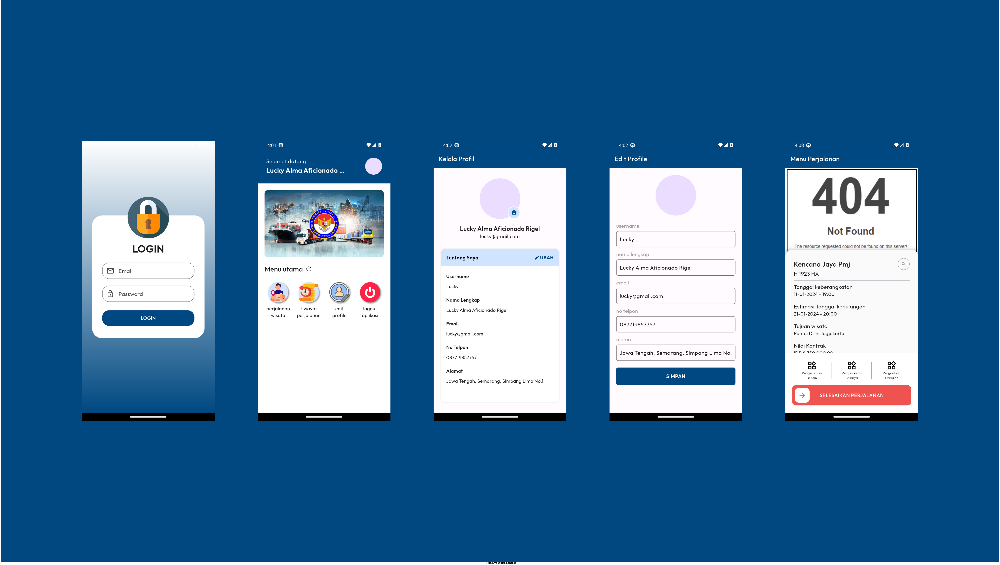
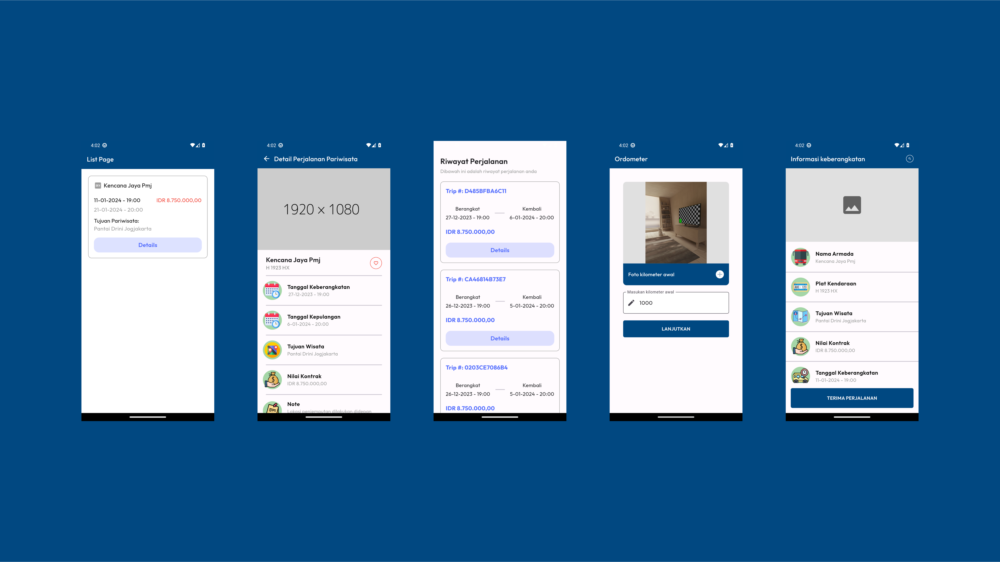

# Aplikasi Trans Flutter

Aplikasi Trans Flutter adalah sebuah aplikasi manajemen transportasi yang dibangun menggunakan bahasa pemrograman Dart dan framework Flutter. Aplikasi ini menyediakan sejumlah fitur utama, termasuk login, dashboard, edit profile, riwayat, dan list perjalanan wisata. Data aplikasi disimpan menggunakan layanan Firebase, seperti Firebase Storage untuk menyimpan file, Firebase Firestore untuk database, dan Firebase Auth untuk manajemen otentikasi.

# Screenshoot

- 
- 

## Fitur-fitur Utama

### 1. Login
- Pengguna dapat login menggunakan akun yang telah terdaftar.
- Firebase Auth digunakan untuk manajemen otentikasi pengguna.

### 2. Dashboard
- Tampilan utama yang menyajikan informasi penting seperti statistik perjalanan dan notifikasi terkini.

### 3. Edit Profile
- Pengguna dapat mengedit informasi profil mereka, termasuk gambar profil.
- Perubahan profil disimpan dan terupdate secara langsung di Firebase Firestore.

### 4. Riwayat
- Menampilkan riwayat perjalanan pengguna dengan detail informasi seperti tanggal, rute, dan jumlah pengeluaran.

### 5. List Perjalanan Wisata
- Menampilkan daftar perjalanan wisata yang tersedia.
- Informasi perjalanan diambil dari Firebase Firestore.

## Penggunaan Firebase

Aplikasi ini memanfaatkan layanan Firebase untuk menyimpan dan mengelola data pengguna. Berikut adalah layanan Firebase yang digunakan:

### 1. Firebase Storage
- Digunakan untuk menyimpan gambar profil pengguna.

### 2. Firebase Firestore
- Menyimpan data perjalanan wisata, riwayat perjalanan, dan informasi profil pengguna.

### 3. Firebase Auth
- Menangani proses otentikasi pengguna.